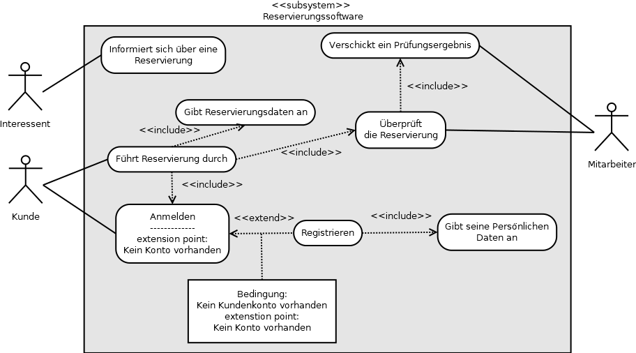
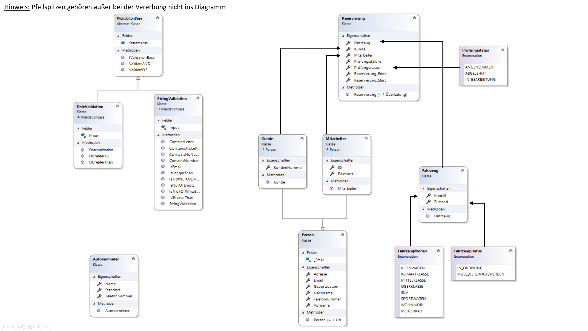

# LernsituationOOP
Ein Lernprojekt das den Aufbau und die Vererbung von Klassen Darstellen soll.
Aufgabe ist es den Prototyp einer Autoreservierung-Software sinvoll umzusetzen. 


## UML Diagramm




## Klassendiagramm




## Speichern einer Liste im JSON Format
### Serilisieren eines Objektes
Folgende Methode wird zum Serilisieren des Listen-Objektes benutzt. Des weiteren wird des formatierte String in einer Datei gespeichert.
```
private static void SerializeObjectToFile(string filePath, object objectToJson)
{
    string jsonString = JsonConvert.SerializeObject(objectToJson);
    File.WriteAllText(filePath, jsonString);
}
```

### Lesen einer Datei
Die Methode überprüft zunächst, ob es die angegebene Datei gibt. Wenn ja, wird der Inhalt dieser Datei versucht zu lesen.
```
private static string ReadTextFromFile(string filePath) => !File.Exists(filePath) ? "" : File.ReadAllText(filePath);
```

### Speichern der Reservierungsliste
Diese Methode ruft die ```SerializeObjectToFile``` Methode auf, um die Liste als Json in einer Datei zu speichern.
```
public static bool SaveReservierungen()
{
    SerializeObjectToFile(Utils.FILE_PATH_RESERVIERUNGEN, Utils.Reservierungen);
    return true;
}
```

### Laden der Reservierungsliste
Es wird versucht, den erhaltenen Text von der Methode ```ReadTextFromFile``` als Objekt zu Deserilisieren. Dabei muss der Typ des Objektes festgelegt werden, in diesem Fall ```List<Reservierung>```. Wenn dies erfolgreich funktioniert hat, wird die Liste übergeben. Sollte es jedoch zu einem Fehler gekommen sein, wird mit ```??``` überprüft ob die Liste ```null``` ist.

```
public static bool LoadReservierungen()
{
    List<Reservierung> reservierungen = JsonConvert.DeserializeObject<List<Reservierung>>(ReadTextFromFile(Utils.FILE_PATH_RESERVIERUNGEN));
    Utils.Reservierungen = reservierungen ?? new List<Reservierung>();
    return true;
}
```


